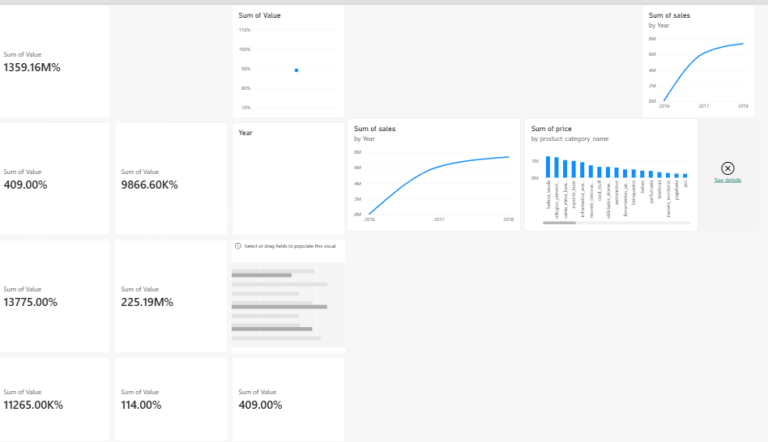

# E-Commerce Business Intelligence Dashboard

## 📌 Project Overview

This project is an end-to-end E-Commerce Business Intelligence solution built using **Python, SQL, Excel, and Power BI**.

The project analyzes the Brazilian E-Commerce Public Dataset by Olist to identify sales trends, customer behavior, product performance, payment patterns, customer satisfaction, and delivery performance.

## 🛠️ Technologies Used

- Python
- Pandas
- Jupyter Notebook
- SQL
- Microsoft Excel
- Power BI
- Git & GitHub

## 🔄 Project Workflow

Raw Data → Data Cleaning → EDA → SQL Analysis → Excel Analysis → Power BI Dashboard → Business Insights

## 📊 Key KPIs

| KPI | Value |
|---|---:|
| Total Product Sales | 13.59M |
| Total Orders | 98.67K |
| Total Items | 112.65K |
| Average Order Value | 137.75 |
| Average Review Score | 4.09 / 5 |
| Average Delivery Time | 12.09 days |
| On-Time Delivery Rate | 89.15% |
| Delivered Order Rate | 97.02% |

## 📈 Key Business Insights

- November 2017 recorded the highest monthly sales.
- Sales increased by approximately **19.99% from 2017 to 2018**.
- **Beauty & Health** was the highest-selling product category.
- **Credit Card** was the most-used payment method.
- **São Paulo** had the highest number of customers.
- The average customer review score was **4.09/5**.
- Approximately **89.15%** of deliveries were completed on time.
- Approximately **97.02%** of orders were delivered.

## 🧹 Data Processing

Python was used for:

- Handling missing values
- Converting date columns
- Cleaning product and order data
- Calculating sales metrics
- Creating customer summaries
- Creating payment summaries
- Analyzing reviews
- Analyzing delivery performance

## 📊 Analysis Performed

### Sales Analysis

- Monthly sales trends
- Yearly sales performance
- Product sales
- Category sales

### Customer Analysis

- Top customer cities
- Top customer states

### Payment Analysis

- Payment method distribution

### Customer Satisfaction

- Review score analysis

### Delivery Analysis

- Average delivery time
- On-time vs late deliveries

## 📊 Power BI Dashboard

The Power BI dashboard provides an interactive view of the project's key business metrics and sales performance.



## 📁 Project Structure

```text
ecommerce-business-intelligence/
│
├── data/
│   ├── raw/
│   └── cleaned/
│
├── excel/
├── python/
├── sql/
├── powerbi/
├── screenshots/
├── reports/
│
├── requirements.txt
├── .gitignore
└── README.md